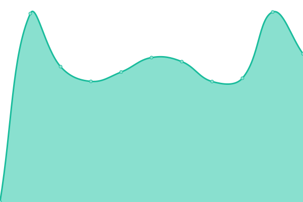

# [📈 Live Status](https://upptime.github.io/upptime): <!--live status--> **🟧 Teilweiser Ausfall**

Dieses Repository enthält den Open-Source-Verfügbarkeitsmonitor und die Statusseite von [Gaming mit Handicap](https://www.gamingmithandicap.de). Erstellt von [Upptime](https://github.com/upptime/upptime).

Mit [Upptime](https://upptime.js.org) kannst du deine/n eigene/n unbegrenzte/n und kostenlose/n Verfügbarkeitsmonitor und Statusseite erstellen, die vollständig von einem GitHub-Repository unterstützt wird. Es verwendet [Probleme](https://github.com/GamingMitHandicap/status/issues) als Vorfallberichte, [Aktionen](https://github.com/gamingmithandicap/status/actions) als Verfügbarkeitsmonitor und [Seiten] https://github.com/gamingmithandicap/status) für die Statusseite.

<!--start: status pages-->
<!-- This summary is generated by Upptime (https://github.com/upptime/upptime) -->
<!-- Do not edit this manually, your changes will be overwritten -->
<!-- prettier-ignore -->
| Link | Status | Verlauf | Reaktionszeit | Verfügbarkeit |
| --- | ------ | ------- | ------------- | ------ |
|  [Webseite & Forum](https://www.gamingmithandicap.de) | Online | [webseite-and-forum.yml](https://github.com/GamingMitHandicap/status/commits/HEAD/history/webseite-and-forum.yml) | 

 999ms
     
 | 

<a href="https://status.gamingmithandicap.de/history/webseite-and-forum">70.83%</a>
    

|  [TeamSpeak 3 Server](server.gamingmithandicap.de) | Online | [team-speak-3-server.yml](https://github.com/GamingMitHandicap/status/commits/HEAD/history/team-speak-3-server.yml) | 

 118ms
     
 | 

<a href="https://status.gamingmithandicap.de/history/team-speak-3-server">70.83%</a>
    

|  [Minecraft Server](server.gamingmithandicap.de) | Online | [minecraft-server.yml](https://github.com/GamingMitHandicap/status/commits/HEAD/history/minecraft-server.yml) | 

 121ms
     
 | 

<a href="https://status.gamingmithandicap.de/history/minecraft-server">70.70%</a>
    

|  [GTA 5 Server](play.gamhc.de) | Offline | [gta-5-server.yml](https://github.com/GamingMitHandicap/status/commits/HEAD/history/gta-5-server.yml) | 

 0ms
     
 | 

<a href="https://status.gamingmithandicap.de/history/gta-5-server">100.00%</a>
    

<!--end: status pages-->

[**Besuche unsere Status-Webseite →**](https://status.gamingmithandicap.de)

## 📄 Lizenz

- Erstellt von: [Upptime](https://github.com/upptime/upptime)
- Code: [MIT](./LICENSE) © [Anand Chowdhary](https://anandchowdhary.com), unterstützt durch [Pabio](https://pabio.com)
- Daten in dem `./history` Ordner: [Open Database License](https://opendatacommons.org/licenses/odbl/1-0/)
- Minecraft & GTA 5 icon von: [dedg3](https://tsicons.com/user/dedg3)
- TeamSpeak 3 icon von: [dAKirby309 (Michael)](https://icon-icons.com/de/pack/Simply-Styled-Icons/195)
