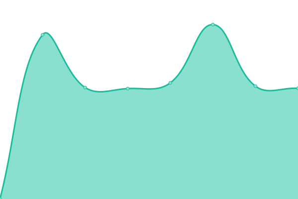

# [📈 Live Status](https://upptime.github.io/upptime): <!--live status--> **🟥 Complete outage**

Dieses Repository enthält den Open-Source-Verfügbarkeitsmonitor und die Statusseite von [Gaming mit Handicap](https://gamingmithandicap.github.io/status). Erstellt von [Upptime](https://github.com/upptime/upptime).

Mit [Upptime](https://upptime.js.org) kannst du deine/n eigene/n unbegrenzte/n und kostenlose/n Verfügbarkeitsmonitor und Statusseite erhalten, die vollständig von einem GitHub-Repository unterstützt wird. Es verwendet [Probleme](https://github.com/GamingMitHandicap/status/issues) als Vorfallberichte, [Aktionen](https://github.com/gamingmithandicap/status/actions) als Verfügbarkeitsmonitor und [Seiten] https://github.com/gamingmithandicap/status) für die Statusseite.

<!--start: status pages-->
<!-- This summary is generated by Upptime (https://github.com/upptime/upptime) -->
<!-- Do not edit this manually, your changes will be overwritten -->
<!-- prettier-ignore -->
| Link | Status | Verlauf | Reaktionszeit | Verfügbarkeit |
| --- | ------ | ------- | ------------- | ------ |
|  [Webseite & Forum](https://www.gamingmithandicap.de) | 🟥 Down | [webseite-and-forum.yml](https://github.com/GamingMitHandicap/status/commits/HEAD/history/webseite-and-forum.yml) | 

 768ms
     
 | 

<a href="https://gamingmithandicap.github.io/status/history/webseite-and-forum">100.00%</a>
    

<!--end: status pages-->

[**Besuche unsere Status-Webseite →**](https://gamingmithandicap.github.io/status)

## 📄 Lizenz

- Erstellt von: [Upptime](https://github.com/upptime/upptime)
- Code: [MIT](./LICENSE) © [Anand Chowdhary](https://anandchowdhary.com), unterstützt durch [Pabio](https://pabio.com)
- Daten in dem `./history` Ordner: [Open Database License](https://opendatacommons.org/licenses/odbl/1-0/)
